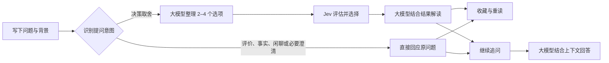

<div align="center">


# 答案之书

**THE BOOK OF ANSWERS**

### 遇事不决，Jev 解决。

把纠结写下来，让下一步清晰一点。<br />
AI 整理可能 · Jev 帮你选择 · 每一页，都是一种新的可能

<br />


[页面预览](#页面预览) · [快速开始](#快速开始) · [API 配置](#api-配置) · [它如何给出答案](#它如何给出答案) · [致敬与鸣谢](#致敬与鸣谢)

</div>

---

周末出去走走，还是留在家充电？面对一个新机会，要不要迈出舒适区？

**答案之书**是一款围绕日常选择设计的 AI 应用：你写下困惑，大模型将背景整理成清晰的候选选项，Jev 从中给出一个方向，再由大模型结合实际选择提供解读。你也可以继续追问，把「为什么」聊清楚，把「下一步」想具体。

它延续了 **`jev_demo`（Jev 调试广场）** 的探索，将模型决策能力放进一本可以提问、收藏和重读的书里。

> 答案是启发，选择始终在你。

## 页面预览

### 翻开答案 · 一页新的可能

暖白纸张、橄榄绿书封和陶土色点缀，让提问像翻开一本书一样自然。四类问题入口和灵感卡片，帮你从一个小问题开始。


<details>
<summary><strong>夜读模式 · 看看深色首页</strong></summary>

支持浅色、深色和跟随系统三种主题。


</details>

### 我的答案 · 留住每一次启发

搜索过去的问题，收藏值得记住的启示，也可以重新打开某一页，接着聊下去。


<sub>以上为本地运行页面截图；历史页内容用于展示界面，不代表你的提问会得到相同结果。</sub>

## 一本书，可以做什么

| 体验 | 你可以做的事 |
| :--- | :--- |
| **把纠结变清晰** | 输入问题与背景，由大模型整理出 2–4 个候选选项 |
| **给下一步一个方向** | 调用 Jev 做出选择，并在接口提供数据时展示选项分布 |
| **读懂这次选择** | 查看结合真实决策结果生成的简短解读 |
| **把问题聊下去** | 围绕原问题继续追问原因、约束和下一步行动 |
| **补充新的条件** | 补全背景后重新生成选项并交给 Jev 评估 |
| **拥有自己的答案书架** | 搜索、收藏、复制、重读与逐条删除历史答案 |
| **用熟悉的方式阅读** | 浅色 / 深色主题、手机布局与桌面布局 |
| **打开就能提问** | 管理员统一配置模型，访客无需填写 API Key；支持 TypeSafe、Vercel 双通道 |

## 快速开始

准备 **Node.js 22 或更新版本**（推荐当前 LTS），以及一个兼容 OpenAI Chat Completions 的大模型服务和一个 Jev 服务账号。

### 1. 下载并配置本地服务

在 PowerShell 中执行：

```powershell
git clone https://github.com/csskrtao/jev-to-answer.git
cd jev-to-answer
npm ci
Copy-Item .env.example .env
notepad .env
```

在 `.env` 中填写大模型和 Jev 的参数。下面以兼容 Chat Completions 的大模型服务与 TypeSafe 通道为例，模型名称和密钥必须替换：

```dotenv
LLM_BASE_URL=https://api.openai.com/v1
LLM_MODEL=your-chat-model
LLM_API_KEY=replace-with-your-llm-key
JEV_PROVIDER=typesafe
JEV_API_KEY=replace-with-your-jev-key
```

`.env` 已被 Git 忽略，`npm start` 会自动读取它；不要把真实密钥写入前端、README 或提交到仓库。

```powershell
npm start
```

打开 **[http://localhost:9001](http://localhost:9001)**。这是独立运行的项目，有自己的依赖、配置和端口，无需同时启动 `jev_demo`。访客直接提问，费用由配置密钥的管理员承担。

### 2. 确认配置并开始使用

按下方 [API 配置](#api-配置) 核对服务地址、模型与密钥，再刷新页面。配置由管理员统一提供，访客无需填写 API Key。

选择分类，写下困惑，点击「翻开我的答案」。试着给它多一点背景：

> 忙碌了一周，有点疲惫，但也想换换心情。这个周末该出去走走，还是留在家好好休息？预算不多，希望周一能恢复精神。

得到答案后，可以继续问「如果只有半天时间，该怎么安排？」，或者收藏这一页，留给以后重读。

## API 配置

**需要配置两类服务：大模型负责理解与回答，Jev 负责决策选择。** 它们的服务地址、模型名称和密钥分别填写。当前版本只读取管理员提供的环境变量，网页不提供模型设置或密钥输入入口。

### 配置应该放在哪里

| 运行方式 | 普通参数 | API 密钥 | 如何生效 |
| :--- | :--- | :--- | :--- |
| 本地 Node.js：`npm start` / `npm run dev` | 项目根目录 `.env` | 同一个 `.env` 文件 | 修改后重启服务 |
| 本地 Workers：`npm run cf:dev` | `wrangler.jsonc` 的 `vars`；本地可用 `.dev.vars` 配置 | 项目根目录 `.dev.vars` | 修改后重启本地模拟 |
| 线上 Cloudflare Workers | `wrangler.jsonc` 的 `vars` | Workers Secrets | 修改 `vars` 后重新部署；Secrets 单独更新 |

`.env` 与 `.dev.vars` 已被 Git 忽略。线上部署不会自动上传这两个文件，也不会自动把其中的密钥转成 Secrets。Node.js 启动时，已有的系统或 PowerShell 环境变量优先于 `.env` 中的同名值。

### 大模型：理解问题、生成选项与解读

| 环境变量 | 是否必填 | 填写方式 |
| :--- | :--- | :--- |
| `LLM_BASE_URL` | 必填 | 服务商提供的 **OpenAI Chat Completions 兼容 API 基础地址**，例如 `https://api.openai.com/v1` |
| `LLM_MODEL` | 必填 | 该服务商实际支持、且你的账号有权调用的模型 ID；不能填写展示昵称或占位符 |
| `LLM_API_KEY` | 通常必填 | 对应大模型服务的密钥原文，不加 `Bearer ` 前缀；仅免鉴权服务可留空 |

`LLM_BASE_URL` 不填写官网、控制台页面或完整的 `/chat/completions` 请求地址；程序会通过 SDK 拼接接口路径。是否包含 `/v1` 以服务商文档为准，也不要填写 `/responses`。

模型需要支持文本对话，并能按提示返回 JSON。项目会设置 `temperature` 和输出 token 上限，所选兼容服务也需要支持这些调用参数。

本地免鉴权服务可以省略 `LLM_API_KEY`，但服务地址必须能从**运行后端的环境**访问。将项目部署到 Cloudflare 后，`localhost` 或 `127.0.0.1` 不会指向你自己的电脑。

### Jev：从候选选项中做出选择

| 环境变量 | 是否必填 | 填写方式 |
| :--- | :--- | :--- |
| `JEV_PROVIDER` | 可选 | `typesafe` 或 `vercel`，默认 `typesafe` |
| `JEV_API_KEY` | 必填 | 当前通道所属平台的密钥原文，不加 `Bearer ` 前缀 |
| `JEV_BASE_URL` | 可选 | 不设置或留空时，使用当前通道的默认地址 |
| `JEV_MODEL` | 可选 | 不设置或留空时，使用当前通道的默认模型 |

两个通道选择一个即可：

| 接入方式 | 服务地址 | 模型 |
| :--- | :--- | :--- |
| `typesafe` | `https://api.typesafe.ai/v1` | `jev-latest` |
| `vercel` | `https://ai-gateway.vercel.sh/v4/ai` | `typesafe-ai/jev` |

**方案 A · TypeSafe API**

从 [TypeSafe 官方文档](https://docs.typesafe.ai/api) 了解 API 访问与密钥获取方式，在配置文件中填写：

```dotenv
# TypeSafe 通道：使用默认服务地址与 jev-latest 模型。
JEV_PROVIDER=typesafe
JEV_API_KEY=replace-with-your-typesafe-key
```

程序会向基础地址下的 `/systemone` 发起请求，因此 `JEV_BASE_URL` 不要重复添加 `/systemone`。

**方案 B · Vercel AI Gateway**

在 [Vercel AI Gateway](https://vercel.com/ai-gateway) 配置网关访问权限并创建 API Key，然后填写：

```dotenv
# Vercel 通道：使用默认网关地址与 typesafe-ai/jev 模型。
JEV_PROVIDER=vercel
JEV_API_KEY=replace-with-your-vercel-gateway-key
```

使用该通道前，确认账号满足网关的计费及模型访问要求；具体额度和付款要求以 Vercel 控制台为准。

**切换通道时，同时替换 `JEV_API_KEY`，并删除配置中旧的 `JEV_BASE_URL`、`JEV_MODEL` 两项，或将它们改成新通道的对应值。** 显式填写的地址和模型优先于默认值，仅修改 `JEV_PROVIDER` 不会自动覆盖旧值。仓库当前的 `wrangler.jsonc` 已显式填写 TypeSafe 的地址与模型，线上切换时也要一并调整。

Jev 使用决策接口，不能当作聊天模型填写到 `LLM_MODEL`。即使只测试普通问答，当前服务的就绪检查仍要求配置 `JEV_API_KEY`。

### 部署到 Cloudflare Workers

页面与 API 一起部署为 Workers。先修改 `wrangler.jsonc` 的 `vars`，填写 `LLM_BASE_URL`、`LLM_MODEL` 和选定的 Jev 通道参数；**密钥不写入 `vars`**。部署到自己的账号时，还应将 `routes` 中的项目域名改为自己已配置的域名，或移除该自定义域名路由，使用 `workers.dev` 地址。

在 PowerShell 中执行：

```powershell
npm ci
npx wrangler login
npx wrangler secret put LLM_API_KEY
npx wrangler secret put JEV_API_KEY
npx wrangler deploy --dry-run
npm run deploy
```

`secret put` 会交互式提示输入密钥。若大模型服务确实无需鉴权，可跳过 `LLM_API_KEY` 的设置；`JEV_API_KEY` 必须配置。也可以在 Cloudflare 控制台的对应 Worker → Settings → Variables and Secrets 中管理，密钥类型选择 Secret。

`deploy --dry-run` 只校验打包，不发布，也不验证密钥或上游模型连通性。`npm run deploy` 才会发布。普通参数建议统一维护在 `wrangler.jsonc` 中，避免只改控制台后被下一次部署覆盖。

当前访问地址为 **[https://jev-to-answer.skrtao.de](https://jev-to-answer.skrtao.de)**（`workers.dev` 地址仍可用）。

本地模拟 Workers 时，将示例复制为已被 Git 忽略的 `.dev.vars`，填入自己的参数后运行：

```powershell
Copy-Item .env.example .dev.vars
notepad .dev.vars
npm run cf:dev
```

`.dev.vars` 只供本地模拟，不会替你配置线上 Secrets。

**旧配置迁移：** 新版本不再读取本地 `data/config.json` 或 Cloudflare `CONFIG` KV，也不会删除其中的旧数据。升级前由管理员将旧模型参数和密钥手动迁移到 `.env` 或 Workers 环境变量／Secrets；未迁移时页面会显示“暂未就绪”。

### 验证配置与排查问题

本地启动后，在另一个 PowerShell 窗口检查服务状态：

```powershell
Invoke-RestMethod -Uri 'http://localhost:9001/api/status'
```

线上验证时将地址替换成自己的站点域名。返回 `ok: true`、`ready: true` 只表示大模型地址、模型名称与当前 Jev 密钥已填写，**不代表密钥有效、余额充足或上游接口连通**。随后在页面提交一个有明确取舍的问题，才能验证大模型生成、Jev 决策和结果解读的完整链路；这一步会使用模型额度。

| 现象 | 优先检查 |
| :--- | :--- |
| 页面显示暂未就绪，或 `ready: false` | `LLM_BASE_URL`、`LLM_MODEL`、`JEV_API_KEY` 是否在当前运行环境中配置；本地修改后是否重启 |
| 已就绪，但生成回答失败 | 大模型地址是否为兼容 API 基础地址；模型 ID、密钥、余额及调用参数是否受支持 |
| 生成选项成功，但没有得到 Jev 选择 | Jev 通道、密钥、地址与模型是否属于同一平台；账号是否有访问权限与可用额度 |
| 切换 Jev 通道后失败 | 是否仍保留旧通道的 `JEV_BASE_URL`、`JEV_MODEL` 或密钥 |
| 本地正常，线上失败 | 是否只填写了 `.env` / `.dev.vars`，没有配置线上 Secrets；模型服务是否能被 Worker 访问 |
| 返回 `429` | 本站请求额度是否用尽；上游服务限流也可能表现为业务接口调用失败 |
| `/api/config` 或 `/api/models` 返回 `404` | 这是预期行为，当前版本已关闭配置与调试接口 |

### 使用额度与费用

Cloudflare 使用 Durable Object 持久化计数，默认限制如下，可通过普通环境变量调整：

| 环境变量 | 默认值 | 含义 |
| :--- | :--- | :--- |
| `REQUESTS_PER_MINUTE` | `12` | 每个 IP 每分钟的业务接口请求数 |
| `REQUESTS_PER_DAY` | `60` | 每个 IP 每日的业务接口请求数 |
| `GLOBAL_REQUESTS_PER_DAY` | `3000` | 全站每日的业务接口请求数 |

每日额度按 **UTC 日期**重置。一次决策回答会请求两个业务接口，可能调用三次上游模型；普通问答只请求一次回答接口和一次大模型。重试、补充和追问会继续使用额度，失败的业务请求也占额度。因此接口额度不是回答条数，也不是金额上限。请同时在模型服务平台设置消费上限。

本地 Node.js 服务使用内存计数，重启后清零；经过反向代理时，访客可能因相同的代理地址共享 IP 额度。线上 Cloudflare 的持久化限额不会因 Worker 实例重启清零。

## 它如何给出答案



**整理、选择、解释各有分工。** Jev 的选择来自实际接口响应；解读失败时仍会保留已获得的选择。Vercel 通道没有提供概率分布时，页面只展示选择，不补造数值。

普通问答不生成候选、不调用 Jev，也不展示决策概率。只有缺少必要信息时才直接向用户澄清，不把“先补充信息”包装成答案选项。事实回答目前没有联网检索，不能用于核验最新消息。

继续追问由大模型结合原问题、原回答和最近 6 轮对话回答；决策记录还会带入候选和 Jev 结果，不会冒充一次新的 Jev 决策。补充条件后重新识别意图，只有决策类才重新调用 Jev。意图识别由大模型完成，仍可能误判，应使用实际模型和代表性问题验证效果。

选项百分比反映模型对候选的相对倾向，**不是现实中的成功率**。

## 本地数据与配置

| 数据 | 保存位置 | 说明 |
| :--- | :--- | :--- |
| 模型配置与密钥 | 本地 `.env`；Workers 本地模拟 `.dev.vars`；线上环境变量与 Secrets | 仅服务端读取，访客只获取是否就绪；本地密钥文件被 Git 忽略 |
| Cloudflare 使用额度 | Durable Object | 持久化保存每 IP 与全站计数；本地运行使用内存计数 |
| 答案、收藏与追问 | 当前浏览器本地存储 | 最多 100 条答案，每条保留最近 20 轮追问 |
| 页面主题 | 当前浏览器 | 记住选择的外观偏好 |

电脑与手机的历史独立，清除浏览器站点数据会清除本地历史。提问、相关上下文和追问会发送给你配置的模型服务进行处理。

公开站点的模型由管理员统一提供。原配置与调试 API 均返回 404，高级调试页面已撤下；业务接口只使用服务端配置，不接受访客指定模型地址或密钥。

<details>
<summary><strong>开发启动、修改端口与手机访问</strong></summary>

开发时自动重启后端，前端修改后刷新浏览器：

```powershell
npm run dev
```

指定其他端口：

```powershell
$env:PORT = '9010'
npm start
```

手机与电脑连接同一个局域网后，可访问 `http://电脑的局域网IP:9001`。使用 `ipconfig` 查看电脑 IPv4 地址，并确保网络与系统防火墙允许访问对应端口。

</details>

## 开发参考

首页使用原生 **HTML / CSS / JavaScript** 和本地 SVG，书本插画由 CSS 绘制，无前端构建步骤，也不依赖 CDN。服务端使用 **Node.js、h3、Vercel AI SDK 与 Zod**。公开站点只提供答案之书业务页面，高级调试台已撤下。

```text
jev-to-answer/
├─ public/              # 首页、交互与主题样式
├─ src/
│  ├─ app.js            # HTTP 接口
│  ├─ book.js           # 决策、补充条件与追问校验
│  ├─ llm.js            # 选项生成、结果解释与追问
│  ├─ jev.js            # TypeSafe / Vercel 双通道适配
│  ├─ runtime-config.js # 从管理员环境变量读取模型配置
│  ├─ quota.js          # 业务接口限额与持久化计数
│  ├─ config.js         # 配置默认值及兼容工具
│  ├─ config-store.js   # 旧本地配置工具，运行入口不再读取
│  ├─ config-kv.js      # 旧 KV 配置工具，运行入口不再读取
│  ├─ timeout.js        # 外部调用超时
│  └─ static.js         # 本地静态文件服务
├─ docs/images/         # README Logo 与页面截图
├─ test/                # 业务与接口测试
├─ .env.example         # 管理员配置模板，不含真实密钥
├─ .env                 # 本地私有配置，不提交
├─ .dev.vars            # Workers 本地模拟配置，不提交
├─ worker.js            # Cloudflare Workers 入口
├─ wrangler.jsonc       # Cloudflare 部署配置
└─ server.mjs           # 本地服务入口，默认端口 9001
```

运行离线测试：

```powershell
npm test
```

测试使用注入依赖和本地 HTTP 服务，覆盖决策流程、追问上下文、概率校验、错误处理、超时及配置保护，不消耗真实 API 配额。

<details>
<summary><strong>HTTP API 速查</strong></summary>

| 方法与路径 | 输入 | 输出 |
| :--- | :--- | :--- |
| `GET /api/status` | 无 | `{ok: true, ready: boolean}`，不返回模型配置 |
| `POST /api/book/options` | `{question, category, supplements?}` | `{options: {question, state, choices, supplements?}}` |
| `POST /api/book/decide` | `{question, options, supplements?}` | `{decision: {choiceId, probabilities, explanation}}` |
| `POST /api/book/follow-up` | `{question, options, decision, messages, followUp, supplements?}` | `{answer}` |

成功响应包含 `ok: true`，失败响应为 `{ok: false, error}`。请将完整 `options` 传回决策与追问接口。`supplements` 为可选字符串数组，最多 5 条，重新评估和追问时应与选项中的补充信息保持一致。

`/api/book/options` 对普通问答返回 `{options: {kind: "direct", intent, question, supplements, title, answer}}`，其中 `intent` 为 `evaluation`、`fact`、`chat` 或 `clarification`。客户端应直接展示 `answer`，跳过 `/decide`；追问仍传回完整 `options`，`decision` 传 `null` 或省略。旧决策结构保持兼容。

追问历史 `messages` 格式为 `[{question, answer}]`，最多传入 6 轮。解释失败时，决策结果标记 `explanationUnavailable: true`。原 `/api/config`、`/api/models` 及调试接口返回 404；管理员通过部署环境修改配置。

</details>


## 致敬与鸣谢

**致敬 `jev_demo` —— Jev 调试广场。**

感谢 [Linux.do](https://linux.do/) 社区成员长期以来的支持与分享。

原项目把「自然语言需求 → 大模型生成参数 → Jev 评估 → 结果可视化与解释」串成一条可以亲手探索的路径，也为 TypeSafe 与 Vercel 双通道接入提供了实践参考。

答案之书沿着这条路径继续往前：把调试台里的参数与评估，转化为日常生活中的提问、选择和解读；再用书页、收藏与追问，让每一次犹豫都有一个可以回来的地方。高级调试台是这段探索的起点；面向访客的公开版本已撤下调试入口与页面。

感谢 `jev_demo` 的启发，以及 TypeSafe / Jev、Vercel AI SDK 和相关开源工具的支持。

相关资料：[TypeSafe 介绍](https://docs.typesafe.ai/introduction) · [API 文档](https://docs.typesafe.ai/api) · [Choice 原语](https://docs.typesafe.ai/primitives/choice)

---

<div align="center">

**每一个犹豫，都值得一个答案。**<br />
<sub>Made for your next chapter · Inspired by jev_demo</sub>

</div>
