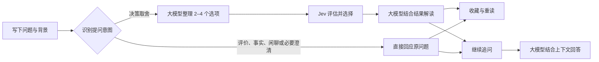

<div align="center">


# 答案之书

**THE BOOK OF ANSWERS**

### 遇事不决，Jev 解决。

把纠结写下来，让下一步清晰一点。<br />
AI 整理可能 · Jev 帮你选择 · 每一页，都是一种新的可能

<br />


[页面预览](#页面预览) · [快速开始](#快速开始) · [它如何给出答案](#它如何给出答案) · [致敬与鸣谢](#致敬与鸣谢)

</div>

---

周末出去走走，还是留在家充电？面对一个新机会，要不要迈出舒适区？

**答案之书**是一款围绕日常选择设计的 AI 应用：你写下困惑，大模型将背景整理成清晰的候选选项，Jev 从中给出一个方向，再由大模型结合实际选择提供解读。你也可以继续追问，把「为什么」聊清楚，把「下一步」想具体。

它延续了 **`jev_demo`（Jev 调试广场）** 的探索，将模型决策能力放进一本可以提问、收藏和重读的书里。

> 答案是启发，选择始终在你。

## 页面预览

### 翻开答案 · 一页新的可能

暖白纸张、橄榄绿书封和陶土色点缀，让提问像翻开一本书一样自然。四类问题入口和灵感卡片，帮你从一个小问题开始。


<details>
<summary><strong>夜读模式 · 看看深色首页</strong></summary>

支持浅色、深色和跟随系统三种主题。


</details>

### 我的答案 · 留住每一次启发

搜索过去的问题，收藏值得记住的启示，也可以重新打开某一页，接着聊下去。


<sub>以上为本地运行页面截图；历史页内容用于展示界面，不代表你的提问会得到相同结果。</sub>

## 一本书，可以做什么

| 体验 | 你可以做的事 |
| :--- | :--- |
| **把纠结变清晰** | 输入问题与背景，由大模型整理出 2–4 个候选选项 |
| **给下一步一个方向** | 调用 Jev 做出选择，并在接口提供数据时展示选项分布 |
| **读懂这次选择** | 查看结合真实决策结果生成的简短解读 |
| **把问题聊下去** | 围绕原问题继续追问原因、约束和下一步行动 |
| **补充新的条件** | 补全背景后重新生成选项并交给 Jev 评估 |
| **拥有自己的答案书架** | 搜索、收藏、复制、重读与逐条删除历史答案 |
| **用熟悉的方式阅读** | 浅色 / 深色主题、手机布局与桌面布局 |
| **打开就能提问** | 管理员统一配置模型，访客无需填写 API Key；支持 TypeSafe、Vercel 双通道 |

## 快速开始

准备 **Node.js 22 或更新版本**（推荐当前 LTS），以及一个兼容 OpenAI Chat Completions 的大模型服务和一个 Jev 服务账号。

### 1. 下载并配置本地服务

在 PowerShell 中执行：

```powershell
git clone https://github.com/csskrtao/jev-to-answer.git
cd jev-to-answer
npm ci
Copy-Item .env.example .env
notepad .env
```

由管理员在 `.env` 中填写服务参数。下面仅为占位示例，请替换为自己的模型名称和密钥：

```dotenv
LLM_BASE_URL=https://api.openai.com/v1
LLM_MODEL=your-chat-model
LLM_API_KEY=replace-with-your-llm-key
JEV_PROVIDER=typesafe
JEV_BASE_URL=https://api.typesafe.ai/v1
JEV_MODEL=jev-latest
JEV_API_KEY=replace-with-your-jev-key
```

`.env` 已被 Git 忽略，`npm start` 会自动读取它；不要把真实密钥写入前端、README 或提交到仓库。

```powershell
npm start
```

打开 **[http://localhost:9001](http://localhost:9001)**。这是独立运行的项目，有自己的依赖、配置和端口，无需同时启动 `jev_demo`。访客直接提问，费用由配置密钥的管理员承担。

### 2. 管理员配置与 Cloudflare 部署

页面和 API 一起发布为 **Cloudflare Workers**。密钥由管理员保存在 Workers Secrets；页面没有模型设置入口，访客不能读取或修改模型连接配置。

| 配置项 | 用途 | Cloudflare 保存位置 |
| :--- | :--- | :--- |
| `LLM_API_KEY` | 大模型服务密钥 | Secret |
| `JEV_API_KEY` | 当前 Jev 通道的密钥 | Secret |
| `LLM_BASE_URL`、`LLM_MODEL` | 大模型服务地址、模型名称 | 普通环境变量 |
| `JEV_PROVIDER` | `typesafe`（默认）或 `vercel` | 普通环境变量 |
| `JEV_BASE_URL`、`JEV_MODEL` | Jev 服务地址、模型名称 | 普通环境变量；可采用下表默认值 |

Jev 的默认接入参数：

| 接入方式 | 服务地址 | 模型 |
| :--- | :--- | :--- |
| `typesafe` | `https://api.typesafe.ai/v1` | `jev-latest` |
| `vercel` | `https://ai-gateway.vercel.sh/v4/ai` | `typesafe-ai/jev` |

**Jev 使用决策接口，不能当作聊天模型填写到 `LLM_MODEL`。**

先在 `wrangler.jsonc` 的 `vars` 中填写普通环境变量；不要把密钥写进该文件。管理员部署时，在 PowerShell 中执行：

```powershell
npm ci
npx wrangler login
npx wrangler secret put LLM_API_KEY
npx wrangler secret put JEV_API_KEY
npx wrangler deploy --dry-run
npm run deploy
```

`secret put` 会交互式提示输入密钥，避免将它直接写进命令历史。也可以在 Cloudflare 控制台的对应 Worker → Settings → Variables and Secrets 中管理。`deploy --dry-run` 只校验构建，不发布；确认配置后再执行 `npm run deploy`。

当前访问地址为 **[https://jev-to-answer.skrtao.de](https://jev-to-answer.skrtao.de)**（`workers.dev` 地址仍可用）。

本地模拟 Workers 时，将示例复制为已被 Git 忽略的 `.dev.vars`，填入自己的参数后运行：

```powershell
Copy-Item .env.example .dev.vars
notepad .dev.vars
npm run cf:dev
```

`.dev.vars` 只供本地模拟，不会替你配置线上 Secrets。

**旧配置迁移：** 新版本不再读取本地 `data/config.json` 或 Cloudflare `CONFIG` KV，也不会删除其中的旧数据。升级前由管理员将旧模型参数和密钥手动迁移到 `.env` 或 Workers 环境变量／Secrets；未迁移时页面会显示“暂未就绪”。

### 免费使用额度

Cloudflare 使用 Durable Object 持久化计数，默认限制如下，可通过普通环境变量调整：

| 环境变量 | 默认值 | 含义 |
| :--- | :--- | :--- |
| `REQUESTS_PER_MINUTE` | `12` | 每个 IP 每分钟的业务接口请求数 |
| `REQUESTS_PER_DAY` | `60` | 每个 IP 每日的业务接口请求数 |
| `GLOBAL_REQUESTS_PER_DAY` | `3000` | 全站每日的业务接口请求数 |

每日额度按 **UTC 日期**重置。一次决策回答会请求两个业务接口，可能调用三次上游模型；普通问答只请求一次回答接口和一次大模型。重试、补充和追问会继续使用额度，失败的业务请求也占额度。因此接口额度不是回答条数，也不是金额上限。请同时在模型服务平台设置消费上限。

本地 Node.js 服务使用内存计数，重启后清零；经过反向代理时，访客可能因相同的代理地址共享 IP 额度。线上 Cloudflare 的持久化限额不会因 Worker 实例重启清零。

### 3. 写下你的第一个问题

选择分类，写下困惑，点击「翻开我的答案」。试着给它多一点背景：

> 忙碌了一周，有点疲惫，但也想换换心情。这个周末该出去走走，还是留在家好好休息？预算不多，希望周一能恢复精神。

得到答案后，可以继续问「如果只有半天时间，该怎么安排？」，或者收藏这一页，留给以后重读。

## 它如何给出答案



**整理、选择、解释各有分工。** Jev 的选择来自实际接口响应；解读失败时仍会保留已获得的选择。Vercel 通道没有提供概率分布时，页面只展示选择，不补造数值。

普通问答不生成候选、不调用 Jev，也不展示决策概率。只有缺少必要信息时才直接向用户澄清，不把“先补充信息”包装成答案选项。事实回答目前没有联网检索，不能用于核验最新消息。

继续追问由大模型结合原问题、原回答和最近 6 轮对话回答；决策记录还会带入候选和 Jev 结果，不会冒充一次新的 Jev 决策。补充条件后重新识别意图，只有决策类才重新调用 Jev。意图识别由大模型完成，仍可能误判，应使用实际模型和代表性问题验证效果。

选项百分比反映模型对候选的相对倾向，**不是现实中的成功率**。

## 本地数据与配置

| 数据 | 保存位置 | 说明 |
| :--- | :--- | :--- |
| 模型配置与密钥 | 本地 `.env`；Workers 本地模拟 `.dev.vars`；线上环境变量与 Secrets | 仅服务端读取，访客只获取是否就绪；本地密钥文件被 Git 忽略 |
| Cloudflare 使用额度 | Durable Object | 持久化保存每 IP 与全站计数；本地运行使用内存计数 |
| 答案、收藏与追问 | 当前浏览器本地存储 | 最多 100 条答案，每条保留最近 20 轮追问 |
| 页面主题 | 当前浏览器 | 记住选择的外观偏好 |

电脑与手机的历史独立，清除浏览器站点数据会清除本地历史。提问、相关上下文和追问会发送给你配置的模型服务进行处理。

公开站点的模型由管理员统一提供。原配置与调试 API 均返回 404，高级调试页面已撤下；业务接口只使用服务端配置，不接受访客指定模型地址或密钥。

<details>
<summary><strong>开发启动、修改端口与手机访问</strong></summary>

开发时自动重启后端，前端修改后刷新浏览器：

```powershell
npm run dev
```

指定其他端口：

```powershell
$env:PORT = '9010'
npm start
```

手机与电脑连接同一个局域网后，可访问 `http://电脑的局域网IP:9001`。使用 `ipconfig` 查看电脑 IPv4 地址，并确保网络与系统防火墙允许访问对应端口。

</details>

## 开发参考

首页使用原生 **HTML / CSS / JavaScript** 和本地 SVG，书本插画由 CSS 绘制，无前端构建步骤，也不依赖 CDN。服务端使用 **Node.js、h3、Vercel AI SDK 与 Zod**。公开站点只提供答案之书业务页面，高级调试台已撤下。

```text
jev-to-answer/
├─ public/              # 首页、交互与主题样式
├─ src/
│  ├─ app.js            # HTTP 接口
│  ├─ book.js           # 决策、补充条件与追问校验
│  ├─ llm.js            # 选项生成、结果解释与追问
│  ├─ jev.js            # TypeSafe / Vercel 双通道适配
│  ├─ runtime-config.js # 从管理员环境变量读取模型配置
│  ├─ quota.js          # 业务接口限额与持久化计数
│  ├─ config.js         # 配置默认值及兼容工具
│  ├─ config-store.js   # 旧本地配置工具，运行入口不再读取
│  ├─ config-kv.js      # 旧 KV 配置工具，运行入口不再读取
│  ├─ timeout.js        # 外部调用超时
│  └─ static.js         # 本地静态文件服务
├─ docs/images/         # README Logo 与页面截图
├─ test/                # 业务与接口测试
├─ .env.example         # 管理员配置模板，不含真实密钥
├─ .env                 # 本地私有配置，不提交
├─ .dev.vars            # Workers 本地模拟配置，不提交
├─ worker.js            # Cloudflare Workers 入口
├─ wrangler.jsonc       # Cloudflare 部署配置
└─ server.mjs           # 本地服务入口，默认端口 9001
```

运行离线测试：

```powershell
npm test
```

测试使用注入依赖和本地 HTTP 服务，覆盖决策流程、追问上下文、概率校验、错误处理、超时及配置保护，不消耗真实 API 配额。

<details>
<summary><strong>HTTP API 速查</strong></summary>

| 方法与路径 | 输入 | 输出 |
| :--- | :--- | :--- |
| `GET /api/status` | 无 | `{ok: true, ready: boolean}`，不返回模型配置 |
| `POST /api/book/options` | `{question, category, supplements?}` | `{options: {question, state, choices, supplements?}}` |
| `POST /api/book/decide` | `{question, options, supplements?}` | `{decision: {choiceId, probabilities, explanation}}` |
| `POST /api/book/follow-up` | `{question, options, decision, messages, followUp, supplements?}` | `{answer}` |

成功响应包含 `ok: true`，失败响应为 `{ok: false, error}`。请将完整 `options` 传回决策与追问接口。`supplements` 为可选字符串数组，最多 5 条，重新评估和追问时应与选项中的补充信息保持一致。

`/api/book/options` 对普通问答返回 `{options: {kind: "direct", intent, question, supplements, title, answer}}`，其中 `intent` 为 `evaluation`、`fact`、`chat` 或 `clarification`。客户端应直接展示 `answer`，跳过 `/decide`；追问仍传回完整 `options`，`decision` 传 `null` 或省略。旧决策结构保持兼容。

追问历史 `messages` 格式为 `[{question, answer}]`，最多传入 6 轮。解释失败时，决策结果标记 `explanationUnavailable: true`。原 `/api/config`、`/api/models` 及调试接口返回 404；管理员通过部署环境修改配置。

</details>

## 致敬与鸣谢

**致敬 `jev_demo` —— Jev 调试广场。**

原项目把「自然语言需求 → 大模型生成参数 → Jev 评估 → 结果可视化与解释」串成一条可以亲手探索的路径，也为 TypeSafe 与 Vercel 双通道接入提供了实践参考。

答案之书沿着这条路径继续往前：把调试台里的参数与评估，转化为日常生活中的提问、选择和解读；再用书页、收藏与追问，让每一次犹豫都有一个可以回来的地方。高级调试台是这段探索的起点；面向访客的公开版本已撤下调试入口与页面。

感谢 `jev_demo` 的启发，以及 TypeSafe / Jev、Vercel AI SDK 和相关开源工具的支持。

相关资料：[TypeSafe 介绍](https://docs.typesafe.ai/introduction) · [API 文档](https://docs.typesafe.ai/api) · [Choice 原语](https://docs.typesafe.ai/primitives/choice)

---

<div align="center">

**每一个犹豫，都值得一个答案。**<br />
<sub>Made for your next chapter · Inspired by jev_demo</sub>

</div>
