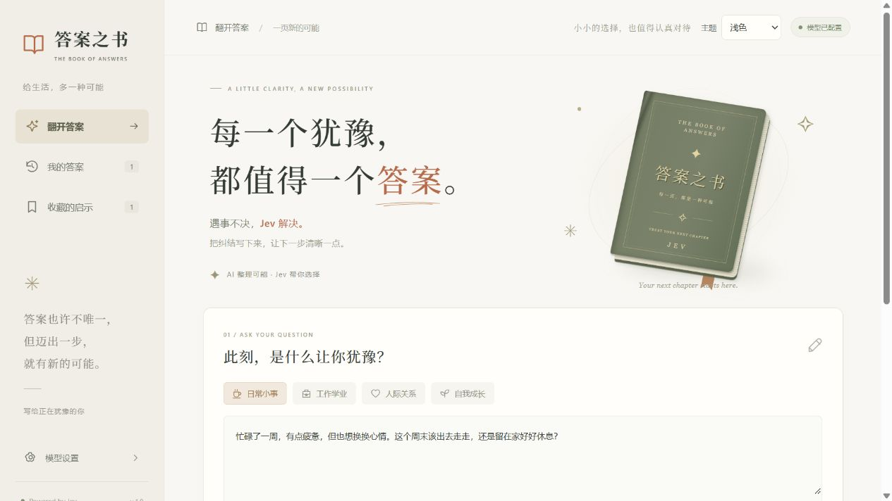
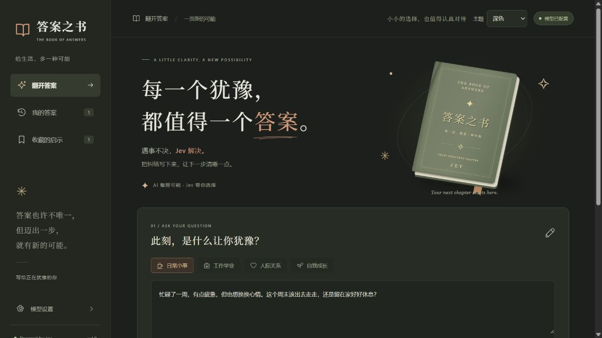
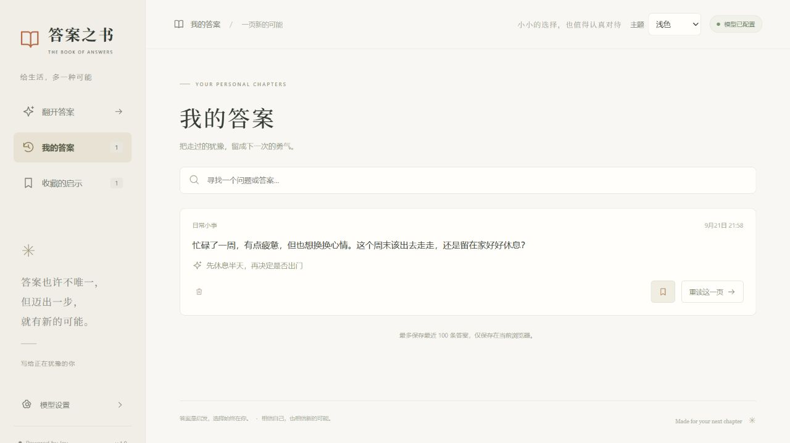
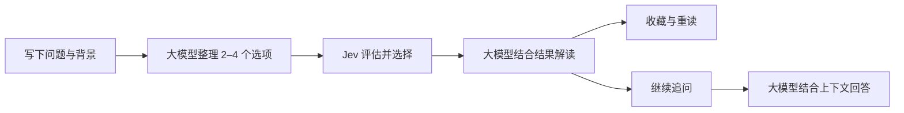

<div align="center">


# 答案之书

**THE BOOK OF ANSWERS**

### 遇事不决，Jev 解决。

把纠结写下来，让下一步清晰一点。<br />
AI 整理可能 · Jev 帮你选择 · 每一页，都是一种新的可能

<br />


[页面预览](#页面预览) · [快速开始](#快速开始) · [它如何给出答案](#它如何给出答案) · [致敬与鸣谢](#致敬与鸣谢)

</div>

---

周末出去走走，还是留在家充电？面对一个新机会，要不要迈出舒适区？

**答案之书**是一款围绕日常选择设计的 AI 应用：你写下困惑，大模型将背景整理成清晰的候选选项，Jev 从中给出一个方向，再由大模型结合实际选择提供解读。你也可以继续追问，把「为什么」聊清楚，把「下一步」想具体。

它延续了 **`jev_demo`（Jev 调试广场）** 的探索，将模型决策能力放进一本可以提问、收藏和重读的书里。

> 答案是启发，选择始终在你。

## 页面预览

### 翻开答案 · 一页新的可能

暖白纸张、橄榄绿书封和陶土色点缀，让提问像翻开一本书一样自然。四类问题入口和灵感卡片，帮你从一个小问题开始。



<details>
<summary><strong>夜读模式 · 看看深色首页</strong></summary>

支持浅色、深色和跟随系统三种主题。



</details>

### 我的答案 · 留住每一次启发

搜索过去的问题，收藏值得记住的启示，也可以重新打开某一页，接着聊下去。



<sub>以上为本地运行页面截图；历史页内容用于展示界面，不代表你的提问会得到相同结果。</sub>

## 一本书，可以做什么

| 体验 | 你可以做的事 |
| :--- | :--- |
| **把纠结变清晰** | 输入问题与背景，由大模型整理出 2–4 个候选选项 |
| **给下一步一个方向** | 调用 Jev 做出选择，并在接口提供数据时展示选项分布 |
| **读懂这次选择** | 查看结合真实决策结果生成的简短解读 |
| **把问题聊下去** | 围绕原问题继续追问原因、约束和下一步行动 |
| **补充新的条件** | 补全背景后重新生成选项并交给 Jev 评估 |
| **拥有自己的答案书架** | 搜索、收藏、复制、重读与逐条删除历史答案 |
| **用熟悉的方式阅读** | 浅色 / 深色主题、手机布局与桌面布局 |
| **保留探索空间** | 支持 TypeSafe、Vercel 双通道，附带高级调试台 |

## 快速开始

准备 **Node.js 22 或更新版本**（推荐当前 LTS），以及一个兼容 OpenAI Chat Completions 的大模型服务和一个 Jev 服务账号。

### 1. 下载并启动

在 PowerShell 中执行：

```powershell
git clone https://github.com/csskrtao/jev-to-answer.git
cd jev-to-answer
npm ci
npm start
```

打开 **[http://localhost:9001](http://localhost:9001)**。如果已经下载项目，在项目根目录运行最后两条命令即可。

这是独立运行的项目，有自己的依赖、配置和端口，无需同时启动 `jev_demo`。

### 2. 连接模型

点击侧栏「模型设置」，分别配置两种能力：

| 配置项 | 负责什么 | 需要填写 |
| :--- | :--- | :--- |
| **大模型** | 整理选项、解释结果、回答追问 | 服务地址、模型名称、API Key；支持获取模型列表 |
| **Jev** | 对候选选项进行评估并给出选择 | 接入方式、对应服务地址、模型名称和 API Key |

Jev 的默认接入参数：

| 接入方式 | 服务地址 | 模型 |
| :--- | :--- | :--- |
| TypeSafe API | `https://api.typesafe.ai/v1` | `jev-latest` |
| Vercel AI Gateway | `https://ai-gateway.vercel.sh/v4/ai` | `typesafe-ai/jev` |

大模型 API Key 可以留空，以适配本地免鉴权服务。已配置的密钥留空保存会保留原值。**Jev 使用决策接口，不能当作聊天模型填入大模型栏。**

### 3. 写下你的第一个问题

选择分类，写下困惑，点击「翻开我的答案」。试着给它多一点背景：

> 忙碌了一周，有点疲惫，但也想换换心情。这个周末该出去走走，还是留在家好好休息？预算不多，希望周一能恢复精神。

得到答案后，可以继续问「如果只有半天时间，该怎么安排？」，或者收藏这一页，留给以后重读。

## 它如何给出答案



**整理、选择、解释各有分工。** Jev 的选择来自实际接口响应；解读失败时仍会保留已获得的选择。Vercel 通道没有提供概率分布时，页面只展示选择，不补造数值。

继续追问由大模型结合原问题、候选选项、Jev 选择和最近 6 轮对话回答，不会冒充一次新的 Jev 决策；如果补充条件并重新评估，则会重新生成选项和调用 Jev。

选项百分比反映模型对候选的相对倾向，**不是现实中的成功率**。

## 本地数据与配置

| 数据 | 保存位置 | 说明 |
| :--- | :--- | :--- |
| 模型配置与密钥 | 服务端 `data/config.json` | 首次在设置中保存后生成，已被 Git 忽略；配置接口返回脱敏结果 |
| 答案、收藏与追问 | 当前浏览器本地存储 | 最多 100 条答案，每条保留最近 20 轮追问 |
| 页面主题 | 当前浏览器 | 记住选择的外观偏好 |

电脑与手机的历史独立，清除浏览器站点数据会清除本地历史。提问、相关上下文和追问会发送给你配置的模型服务进行处理。

当前版本适用于本机或可信局域网，配置接口没有用户鉴权。公开部署前，需要添加访问控制、用户隔离和限流。

<details>
<summary><strong>开发启动、修改端口与手机访问</strong></summary>

开发时自动重启后端，前端修改后刷新浏览器：

```powershell
npm run dev
```

指定其他端口：

```powershell
$env:PORT = '9010'
npm start
```

手机与电脑连接同一个局域网后，可访问 `http://电脑的局域网IP:9001`。使用 `ipconfig` 查看电脑 IPv4 地址，并确保网络与系统防火墙允许访问对应端口。

</details>

## 开发参考

首页使用原生 **HTML / CSS / JavaScript** 和本地 SVG，书本插画由 CSS 绘制，无前端构建步骤，也不依赖 CDN。服务端使用 **Node.js、h3、Vercel AI SDK 与 Zod**。保留的高级调试台使用 Vue / Element Plus CDN，可从模型设置进入。

```text
jev-to-answer/
├─ public/              # 首页、交互、主题样式与高级调试台
├─ src/
│  ├─ app.js            # HTTP 接口
│  ├─ book.js           # 决策、补充条件与追问校验
│  ├─ llm.js            # 选项生成、结果解释与追问
│  ├─ jev.js            # TypeSafe / Vercel 双通道适配
│  ├─ config-store.js   # 配置持久化与脱敏
│  ├─ timeout.js        # 外部调用超时
│  └─ static.js         # 静态文件服务
├─ docs/images/         # README Logo 与页面截图
├─ test/                # 业务与接口测试
├─ data/config.json     # 本地私有配置，不提交
└─ server.mjs           # 服务入口，默认端口 9001
```

运行离线测试：

```powershell
npm test
```

测试使用注入依赖和本地 HTTP 服务，覆盖决策流程、追问上下文、概率校验、错误处理、超时与配置脱敏，不消耗真实 API 配额。

<details>
<summary><strong>HTTP API 速查</strong></summary>

| 方法与路径 | 输入 | 输出 |
| :--- | :--- | :--- |
| `GET /api/config` | 无 | 脱敏配置与 `apiKeyConfigured` |
| `POST /api/config` | `{llm, jev}` | 保存后的脱敏配置 |
| `POST /api/models` | 可选 `{llm}` | `{models}` |
| `POST /api/book/options` | `{question, category, supplements?}` | `{options: {question, state, choices, supplements?}}` |
| `POST /api/book/decide` | `{question, options, supplements?}` | `{decision: {choiceId, probabilities, explanation}}` |
| `POST /api/book/follow-up` | `{question, options, decision, messages, followUp, supplements?}` | `{answer}` |

成功响应包含 `ok: true`，失败响应为 `{ok: false, error}`。请将完整 `options` 传回决策与追问接口。`supplements` 为可选字符串数组，最多 5 条，重新评估和追问时应与选项中的补充信息保持一致。

追问历史 `messages` 格式为 `[{question, answer}]`，最多传入 6 轮。解释失败时，决策结果标记 `explanationUnavailable: true`。程序调用配置接口可用 `clearApiKey: true` 明确清除相应密钥。

</details>

## 致敬与鸣谢

**致敬 `jev_demo` —— Jev 调试广场。**

原项目把「自然语言需求 → 大模型生成参数 → Jev 评估 → 结果可视化与解释」串成一条可以亲手探索的路径，也为 TypeSafe 与 Vercel 双通道接入提供了实践参考。

答案之书沿着这条路径继续往前：把调试台里的参数与评估，转化为日常生活中的提问、选择和解读；再用书页、收藏与追问，让每一次犹豫都有一个可以回来的地方。项目中保留的高级调试台，也留下了这段探索的起点。

感谢 `jev_demo` 的启发，以及 TypeSafe / Jev、Vercel AI SDK 和相关开源工具的支持。

相关资料：[TypeSafe 介绍](https://docs.typesafe.ai/introduction) · [API 文档](https://docs.typesafe.ai/api) · [Choice 原语](https://docs.typesafe.ai/primitives/choice)

---

<div align="center">

**每一个犹豫，都值得一个答案。**<br />
<sub>Made for your next chapter · Inspired by jev_demo</sub>

</div>
